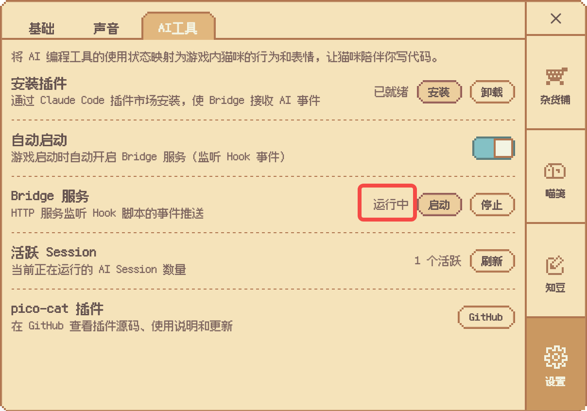

# PicoCat Claude Code Plugin

与 PicoCat 桌面宠物游戏互动的 Claude Code 插件。

## 功能

- **气球互动**：戳气球获得金币或装饰奖励
- **猫盆管理**：查看猫盆状态、购买消耗品并填充猫盆
- **状态联动**：Claude Code 会话事件映射为猫咪动画

## 前置条件

- PicoCat 游戏正在运行，且设置中开启了 Bridge 自动启动



## 安装

```bash
# 从 GitHub marketplace 安装
/plugin marketplace add wersling/pico-cat-plugin
/plugin install pico-cat
```

## Skill

使用 `/pico-cat:balloon` 查看和戳气球，获得金币或装饰奖励。支持 `/loop` 定时轮询：

```
/loop 60s /pico-cat:balloon
```

使用 `/pico-cat:bowl` 管理猫盆，自动购买消耗品并填充。支持 `/loop` 定时轮询：

```
/loop 10m /pico-cat:bowl
```

## 更新

```bash
# 进入插件管理菜单，选择 pico-cat 进行更新
/plugin
/reload-plugins
```

## 卸载

```bash
/plugin uninstall pico-cat
/reload-plugins

# 同时移除 marketplace（可选）
/plugin marketplace remove wersling/pico-cat-plugin
```

## 原理

插件通过 MCP Streamable HTTP 协议连接到 PicoCat 游戏的 Bridge 服务器（`http://127.0.0.1:23336/mcp`）。
